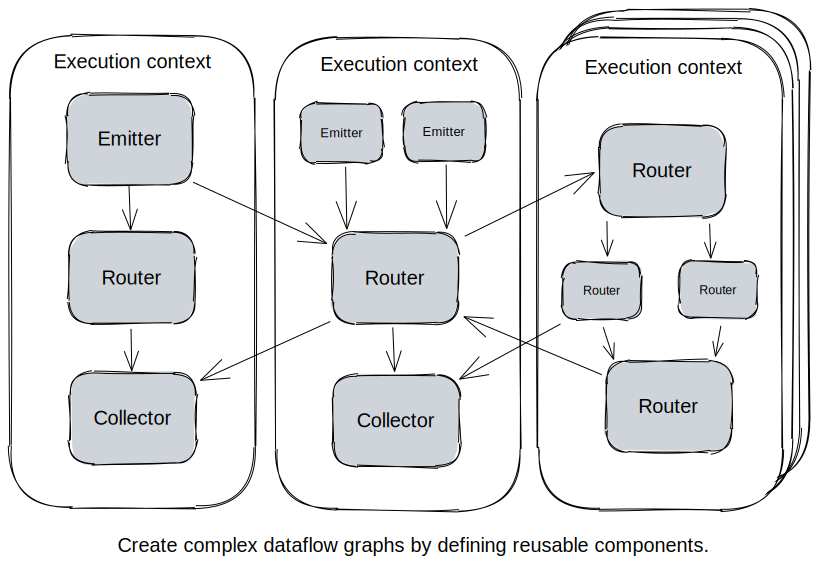

<!-- PROJECT LOGO -->
<br />
<p align="center">
<!--   <a href="https://github.com/asrvsn/ndgpy">
    
  </a> -->

  <h3 align="center">ndgpy: serialization-free numeric dataflow graphs for NumPy</h3>

  <p align="center">
    Run parallel event-based numerical processes on a single host by defining NumPy-based data-emitting components. Inspired by <a href="https://en.wikipedia.org/wiki/Transport_triggered_architecture">transport-triggered processing</a> and <a href="https://en.wikipedia.org/wiki/Systolic_array">systolic arrays</a>.
    <br />
    <a href="https://a0s.co/docs/ndgpy"><strong>Explore the docs [coming soon]»</strong></a>
  </p>
</p>


<!-- TABLE OF CONTENTS -->
<details open="open">
  <summary><h2 style="display: inline-block">Table of Contents</h2></summary>
  <ol>
    <li>
      <a href="#about">About</a>
      <ul>
        <li><a href="#features">Features</a></li>
      </ul>
    </li>
    <li>
      <a href="#getting-started">Getting Started</a>
      <ul>
        <li><a href="#prerequisites">Prerequisites</a></li>
        <li><a href="#installation">Installation</a></li>
      </ul>
    </li>
    <li><a href="#usage">Usage</a></li>
     <li><a href="#gallery">Usage</a></li>
    <li><a href="#roadmap">Roadmap</a></li>
    <li><a href="#license">License</a></li>
    <li><a href="#references">References</a></li>
  </ol>
</details>


<!-- ABOUT THE PROJECT -->
## About



This library provides a way of expressing numeric computations involving I/O as graphs laid out across processes. 

Like many libraries for parallel task scheduling ([Joblib](https://joblib.readthedocs.io/en/latest/), [Ray](https://github.com/ray-project/ray), [Dask](https://dask.org/), [Airflow](https://airflow.apache.org/)), it provides a declarative interface for constructing computation graphs.

However, I often found these libraries to be too much for what I wanted (running simple interdependent numerical codes in parallel) and sometimes imposed too many restrictions (e.g. statelessness). `ndgpy` is not a replacement for any of those libraries, and simply provides a way to connect **numerically valued** subprograms with **serialization-free interconnects** on a **single host**, with **transparent user-defined scheduling**. It's really just a thin layer on top of [`asyncio`](https://docs.python.org/3/library/asyncio.html).

### Features

* inter-component communication using [shared memory](https://docs.python.org/3/library/multiprocessing.shared_memory.html) instead of serialization
* support for components requiring initialization-time [resources](https://github.com/asrvsn/ndgpy/blob/master/ndgpy/nodes/interfaces.py#L22) 
* support for components [parametrizing](https://github.com/asrvsn/ndgpy/blob/master/ndgpy/nodes/interfaces.py#L35) other components (without triggering them)


<!-- GETTING STARTED -->
## Getting Started

To get a local copy up and running follow these simple steps.

### Prerequisites

* python >= 3.8

This has not been tested in all environments (especially Windows), so please report bugs.

### Installation

* In local environment
```sh
pip install git+git://github.com/asrvsn/ndgpy.git
```
* As a project dependency
```sh
# Add to `requirements.txt`
-e git://github.com/asrvsn/ndgpy.git#egg=ndgpy
```


<!-- USAGE EXAMPLES -->
## Usage

There are three main components, named `Emitter`, `Router`, and `Collector` (named for the legs of a transistor). 
* `Emitter` is a parent node in the graph which is executed repeatedly whenever possible
* `Collector` is a leaf node which executes whenever all its parents have executed 
* `Router` is a node which is both an `Emitter` and a `Collector`. 

`Emitter` and `Router`, being the data-emitting components, have output types specified at initialization as [NumPy structured data types](https://numpy.org/doc/stable/user/basics.rec.html). This allows the program to exchange data using shared memory rather than serialization, and is suitable in cases where internal states are of a fixed size and high throughput is desired.

Together, these components are strung together in a `Layout` (data-flow graph), and pinned to specific processes ("execution contexts") by the user. This is especially useful if there are I/O-heavy and computation-heavy components, and it is desirable to avoid one blocking the other. Even graphs consisting of entirely computational elements can benefit from this layout, since it allows subgraphs to execute at their own intrinsic timescales (e.g., a parameter update process vs. a model sparsification process). 


### Example: processes running at two timescales

Consider the following example with a "fast" and a "slow" data-emitting process:

```python
class Noise(Emitter):
  ''' This process emits random values every `dt` seconds. '''
  def __init__(self, dt: float):
    self.dt = dt
    super().__init__(np.float64) 

  async def compute(self):
    await asyncio.sleep(self.dt)
    return np.random.uniform()

class Printer(Collector):
  ''' Prints received values '''
  async def compute(self, *values):
    print(values)

class MyLayout(Layout):
  async def setup(self):

    # Declare a fast noise emitter on process 1
    ctx1 = self.new_context()
    noise1 = Noise(0.1)
    printer1 = Printer()
    await self.add(ctx1, [noise1, printer1])
    await self.connect(noise1, printer)

    # Declare a slow noise emitter on process 2
    ctx2 = self.new_context()
    noise2 = Noise(1.0)
    printer2 = Printer()
    await self.add(ctx2, [noise2, printer2])

    # Enforce the second printer to depend on both emitters -- thus having the slowest throughput out of all nodes
    await self.connect(noise1, printer2)
    await self.connect(noise2, printer2)

MyLayout().start()
```

### Example: asynchronous LQR controller for cart-pole problem

_Inspired by [http://www.cs.cmu.edu/~cga/dynopt/ltr/](http://www.cs.cmu.edu/~cga/dynopt/ltr/)_

Suppose we have an inverted pendulum with a mass (also called cart-pole) from which we can take noisy readings over I/O. 
We could perform state estimation & control in the same execution context, but these could be arbitrarily complex -- and while we're doing so, we might miss out on readings for other critical applications (in this case, logging). 

This problem can be solved succinctly in `ndgpy` by declaring the sensor and controller in different execution contexts, as defined in
`CartPoleSystem` below.

```python
state_type = np.dtype([('cart_x', np.float64), ('cart_v', np.float64), ('pole_theta', np.float64), ('pole_omega', np.float64)])

class Sensor(Emitter):
  ''' Reads out noisy samples of cart+pole state from environment '''
  def __init__(self):
    super().__init__(state_type)

  async def compute(self):
    ''' Obtain readings asynchronously '''
    self.output['cart_x'] = await sense_cart_x() # Read over I/O
    self.output['cart_v'] = await sense_cart_v()
    self.output['pole_theta'] = await sense_pole_theta()
    self.output['pole_omega'] = await sense_pole_omega()

class Observer(Router):
  ''' Estimates true state of the system using a Kalman filter ''' 
  def __init__(self):
    self.F = np.array([[0, 0, 1, 0], [0, 0, 0, 0], [0, 0, 0, 1], [0, 10, 0, 0]]) # Linearized system dynamics
    self.Q = np.eye(4) # Covariance of process noise
    self.R = np.eye(4) # Covariance of observation noise
    self.B = np.array([[0], [1], [0], [1]]) # Control influence
    self.x_t = None # Current state estimate
    self.P_t = np.eye(4) # Current covariance estimate
    super().__init__(state_type)

  async def compute(self, readout, control):
    if self.x_t is None:
      self.x_t = readout
    else:
      # Pretend these computations are really expensive
      K_t = self.P_t@np.linalg.inv(self.R)
      dx_dt = self.F@self.x_t + self.B@control + K_t@(readout - self.x_t)
      dP_dt = self.F@self.P_t + self.P_t@self.F + self.Q - K_t@self.R@K_t.T
      self.x_t += dx_dt * dt
      self.P_t += dP_dt * dt
    self.output[:] = self.x_t[:]

class Controller(Router):
  ''' LQR controller sends outputs via I/O ''' 
  def __init__(self):
    self.F = np.array([[0, 0, 1, 0], [0, 0, 0, 0], [0, 0, 0, 1], [0, 10, 0, 0]]) # Linearized system dynamics
    self.B = np.array([[0], [1], [0], [1]]) # Control influence
    self.Qc = np.eye(4) # Quadratic state cost
    self.Rc = np.eye(1) # Linear input cost
    self.Kc = solve_ricatti(self.F, self.B, self.Qc, self.Rc) # Obtain optimal control gain
    super.__init__([('control', np.float64)])

  async def compute(self, estimate):
    # Pretend these computations are really expensive
    u = -self.Kc@estimate
    self.output['control'] = u
    await apply_control(u) # Write over I/O

class Logger(Collector):
  ''' Log the system states ''' 
  async def compute(self, state):
    await write_to_file(state)

class CartPoleSystem(Layout):
  ''' 
  This system avoids missing out on logging readings by running expensive estimation/control operations in a separate context.
  '''
  async def setup(self):

    # Run sensor & logger on Context 1
    ctx1 = self.new_context()
    sensor = Sensor()
    logger = Logger()
    await self.add(ctx1, [sensor, logger])
    await self.connect(sensor, logger)

    # Run observer & controller on Context 2
    ctx2 = self.new_context()
    observer = Observer()
    controller = Controller()
    await self.add(ctx2, [observer, controller])
    await self.connect(sensor, observer)
    await self.connect(observer, controller)
    await self.connect(controller, observer)

CartPoleSystem().start()
```

In this system, there is no serialization happening between `Sensor` and `Controller` even though they execute in parallel -- so we can use states of very high dimension without much cost.

### Example: test throughput of a program

By inheriting the `Resourced` class, we can define start-up and shut-down procedures. We use this to define the following node at any point in the graph as a measurement probe of throughput.

```python
class Throughput(Collector, Resourced):
  async def start(self, res):
    self.start_time = datetime.datetime.now()
    self.ctr = 0

  async def stop(self):
    delta = (datetime.datetime.now() - self.start_time) / np.timedelta64(1, 's')
    print(f'Throughput: {self.ctr/delta} / sec')

  async def compute(self, values):
    self.ctr += 1
```

Run `python -m ndgpy.examples.throughput` or see the [script](https://github.com/asrvsn/ndgpy/blob/master/ndgpy/examples/throughput.py).

_For more examples, please refer to the [Documentation (coming soon)](https://a0s.co/docs/ndgpy)_

<!-- ROADMAP -->
## Roadmap

See the [open issues](https://github.com/asrvsn/ndgpy/issues) for a list of proposed features (and known issues).

* 

<!-- LICENSE -->
## License

Distributed under the MIT License. See `LICENSE` for more information.


<!-- ACKNOWLEDGEMENTS -->
